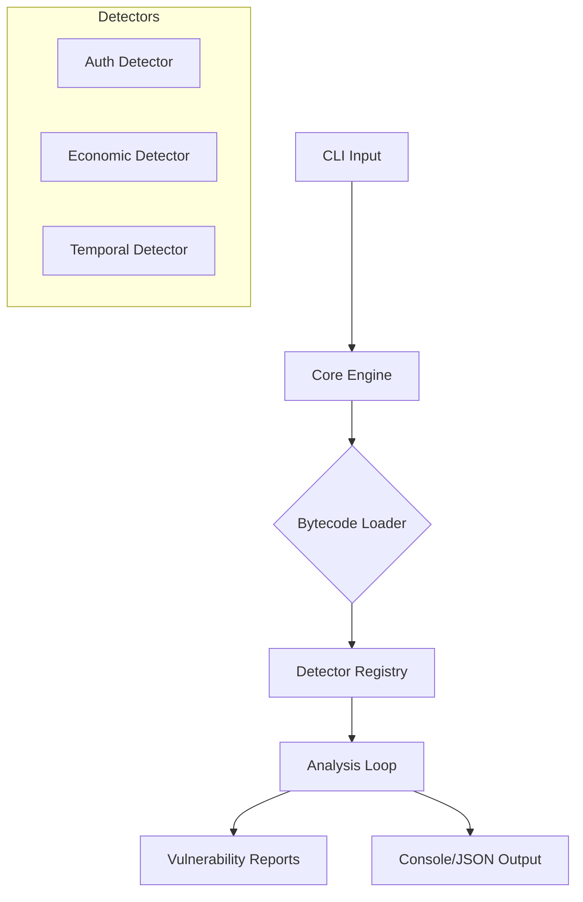

# SUIZERO System Documentation

**Version:** 1.0.1  
**Target:** Sui Move Bytecode (`.mv`)

---

## 🏗️ System Architecture

SUIZERO is built as a modular static analysis pipeline designed for extensibility and precision.

### High-Level Component Diagram



### 1. Core Engine
The heart of SUIZERO is the `SuiSecurityAnalyzer` (in `src/core/engine.rs`). It orchestrates the entire process:
1.  **Loading**: Reads compiled `.mv` files using `move-binary-format`.
2.  **Context Creation**: Builds a localized `DetectionContext` containing the module, function definitions, and identifying handles.
3.  **Dispatch**: Iterates through every function in the module and feeds it to the active detectors.

### 2. Detector Registry
Located in `src/detectors/mod.rs`, this registry manages all 38+ vulnerability patterns.
*   **Modular Design**: Each detector is a standalone struct implementing the `SecurityDetector` trait.
*   **Categorization**: Detectors are grouped by domain (e.g., `Arithmetic`, `AccessControl`, `Temporal`).

---

## 🔬 How Analysis Works

Unlike source-code linters (which read text), SUIZERO reads **Bytecode**. This is "what you see is what you get" on the blockchain.

### Phase 1: Instruction Decoding
We iterate over the raw bytecode instructions (e.g., `MoveLoc`, `Call`, `BrFalse`).
*   **Advantage**: We see compiler-inserted code that developers might miss.
*   **Challenge**: High-level intent is obscured (no variable names, just indices).

### Phase 2: Heuristic Analysis (Lightweight)
For simple bugs (like "Division by Zero"), we look for specific opcode sequences:
```
MoveLoc(x)
LdConst(0)
Div          <-- DANGER!
```

### Phase 3: Abstract Interpretation (Heavyweight)
For complex vulnerabilities like **SUI-033 (Phantom Auth)**, we perform **Taint Analysis**.

#### The Phantom Auth Algorithm:
1.  **Snapshot**: Identify all parameters of a public function.
2.  **Tagging**: Mark "Authorization-like" parameters (e.g., `AdminCap`, `Owner`) as **Tainted**.
3.  **Trace**: Simulate execution. If a Tainted parameter is used in a permission-checking function (like `assert!`), we verify the taint is "Cleansed".
4.  **Verdict**: If the function ends and the parameter was **never used** in a check, alert **SUI-033**.

### Phase 4: Cross-Function Invariant (SUI-034)
This is our most advanced feature (in `src/detectors/extended/state.rs`).
1.  **Pairing**: We identify semantic pairs (e.g., `deposit` / `withdraw`).
2.  **State Mapping**: We map which fields are modified in `deposit`.
3.  **Symmetry Check**: We verify `withdraw` touches the **exact inverse** or **symmetric set** of fields.
4.  **Violation**: If `deposit` updates `balance` + `fees`, but `withdraw` only updates `balance`, we flag a **Fee Retention Bug**.

---

## 🛠️ Key Modules

| Module | Purpose | Critical Logic |
|--------|---------|----------------|
| `src/core/taint.rs` | Taint Tracking | Tracks data flow from inputs to usage. |
| `src/detectors/extended/state.rs` | Invariant | Solves SUI-034 (Logic bugs). |
| `src/detectors/extended/temporal.rs` | Temporal | Solves SUI-036 (TOCTOU/Race). |
| `src/reporters` | Output | Formats JSON/Markdown reports. |

---

## 🚀 Extensibility

Adding a new detector is simple:
1.  Create a file in `src/detectors/my_category.rs`.
2.  Implement `SecurityDetector` trait.
3.  Register it in `src/detectors/mod.rs`.
4.  Recompile.

```rust
impl SecurityDetector for MyDetector {
    fn detect(&self, ctx: &DetectionContext) -> Vec<SecurityIssue> {
        // Your logic here
    }
}
```

---

*This document serves as the technical reference for the SUIZERO engine.*
